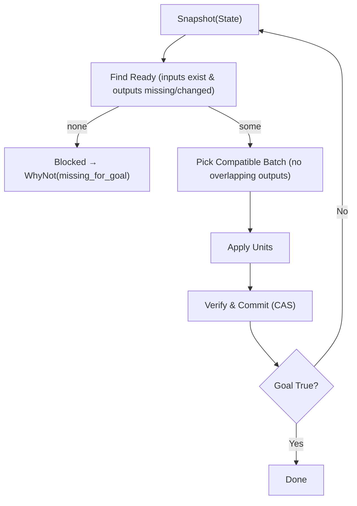
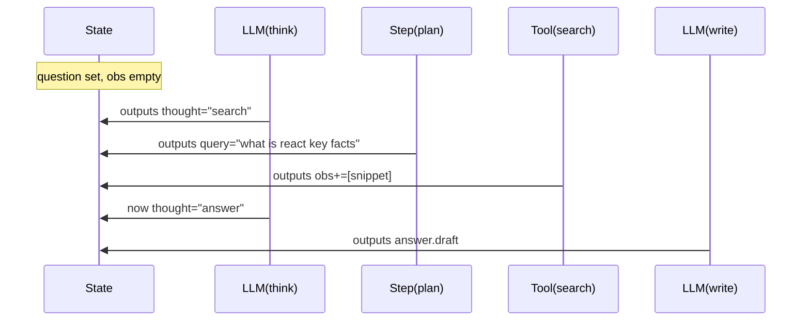
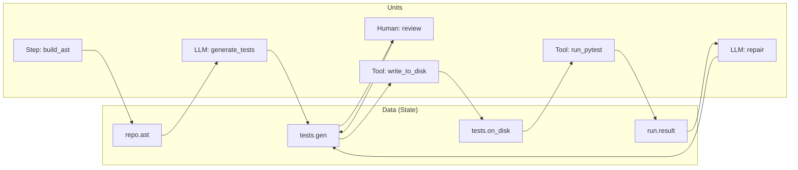
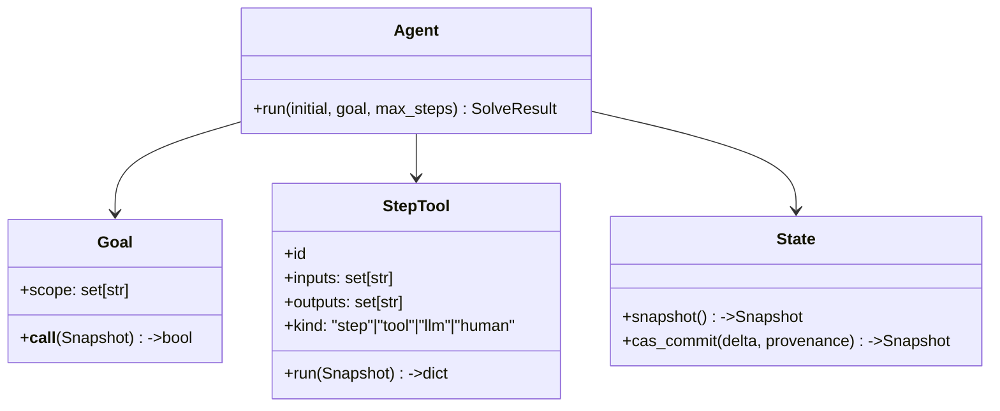

# Build an Agent with Ranger (Step/Tool DX Guide)

This guide shows you how to build production-grade agents with **zero orchestration code**. You write tiny Python functions, declare what each one **reads** and **writes** in a shared **State**, and call `Agent.run(...)`. The engine figures out *when* to run each unit, runs safe work in parallel, and stops when your **Goal** is true.

> ## DX vocabulary (plain English)
>
> * **Step** — a **pure transform** over State (no side effects).
> * **Tool** — an **action** that may have side effects (CLI/API/LLM/Human).
> * **Goal** — a predicate over State that means “we’re done.”
> * **Agent** — runs ready Steps/Tools until the Goal is satisfied.
> * Sugar: `@llm` (LLM Tool), `@human` (review/approval Tool).
> * Param names: prefer **`inputs` / `outputs`** (we also accept `uses` / `updates` as aliases).

---

# 1) Mental model in 90 seconds

* The **State** is a typed key-value map, e.g. `{"repo.ast": ..., "tests.gen": ...}`.
* A Step/Tool declares what it **inputs** (reads) and **outputs** (writes). It cannot write anything else.
* Readiness: a unit becomes **ready** when all its `inputs` exist **and** either:

  1. any of its `outputs` are missing, **or**
  2. the values of its `inputs` changed since it last ran.
* The Agent picks a batch of ready units with **disjoint outputs** (no two write the same key) and applies them (safe parallelism).
* **No loops.** As State changes, downstream units become ready again. ReAct, retries, and repair **emerge from the data**.



---

# 2) Minimal API you’ll use

```python
from core.sdk import step, tool, llm, human, goal, Agent
```

* `@step(inputs=[...], outputs=[...])` – pure compute (no side effects).
* `@tool(inputs=[...], outputs=[...])` – actions (CLI/API/LLM/Human).
* `@llm(...)` – convenience wrapper around `@tool` for LLM calls (handles prompts/JSON/provider).
* `@human(...)` – convenience wrapper for non-blocking review/approval.
* `@goal(scope={...})` – declares which keys matter for completion.
* `Agent([...]).run(initial=..., goal=..., max_steps=...)` – executes until done or budget.

> **Aliases:** `uses/updates` are accepted everywhere as synonyms for `inputs/outputs`.

---

# 3) Hello, Agent (5 minutes)

```python
from core.sdk import step, goal, Agent

@step(inputs=["a"], outputs=["b"])
def plus_one(st):
    return {"b": st["a"] + 1}

@step(inputs=["b"], outputs=["c"])
def times_two(st):
    return {"c": st["b"] * 2}

@goal(scope={"c"})
def done(st):
    return st.get("c") == 4

agent = Agent([plus_one, times_two])
res = agent.run(initial={"a": 1}, goal=done, max_steps=10)
assert res.ok and res.final.value("c") == 4
```

**No orchestration.** The Agent sees `a`, runs `plus_one` → makes `b`; then `times_two` becomes ready, writes `c`; the Goal passes.

---

# 4) ReAct in \~25 lines (Reason → Act → Observe → Refine)

```python
from core.sdk import step, tool, llm, goal, Agent

# REASON: pick next action based on observations
@llm(
  inputs=["question","obs"],
  outputs=["thought"],
  system="Return JSON {thought:str} with either 'search' or 'answer'.",
  template='{"thought":"{{ "search" if (obs|length)<2 else "answer" }}"}',
  schema={"type":"object","properties":{"thought":{"type":"string"}},"required":["thought"]},
  provider=my_llm_provider,
)
def think(st): pass

# PLAN: craft a query when we need search (pure)
@step(inputs=["question","thought"], outputs=["query"])
def plan(st):
    return {"query": f"{st['question']} key facts"} if st["thought"] == "search" else {"query": ""}

# ACT: perform the search (side effect → Tool)
@tool(inputs=["query","obs"], outputs=["obs"])
def search(st):
    q = st["query"]; obs = st.get("obs", [])
    return {"obs": obs + ([{"source":"stub","snippet":f"Result:{q}"}] if q else [])}

# WRITE: synthesize a draft answer
@llm(
  inputs=["question","obs"],
  outputs=["answer.draft"],
  system="Return JSON {text:str, citations:list}.",
  template='{"text":"Answer to {{question}} with {{obs|length}} observations.","citations":[]}',
  schema={"type":"object","properties":{"text":{"type":"string"},"citations":{"type":"array"}},"required":["text","citations"]},
  provider=my_llm_provider,
)
def write(st): pass

@goal(scope={"answer.draft"})
def done(st): return "answer.draft" in st

Agent([think, plan, search, write]).run(initial={"question":"What is ReAct?"}, goal=done)
```



---

# 5) A pragmatic Test-Writer (production-flavored)

### 5.1 State keys (convention)

* `repo.root: str` – project path
* `repo.ast: dict` – AST index (files/functions/classes)
* `tests.gen: dict` – generated tests `{files:[{path,content}]}`
* `tests.on_disk: bool` – were tests written to filesystem
* `run.result: dict` – pytest result `{passed, return_code, stdout, stderr, failed}`
* `review.status: str` – `"approved"` / `"changes-requested"`

### 5.2 Steps & Tools

```python
from core.sdk import step, tool, llm, human, goal, Agent

# Build a minimal AST index (pure Step)
@step(inputs=["repo.root"], outputs=["repo.ast"])
def build_ast(st):
    import ast, os
    root = st["repo.root"]; files_idx = []
    for dirpath, _, files in os.walk(root):
        for f in files:
            if f.endswith(".py") and not f.startswith("_"):
                p = os.path.join(dirpath, f)
                try:
                    tree = ast.parse(open(p, "r", encoding="utf-8").read())
                    funcs  = [n.name for n in ast.walk(tree) if isinstance(n, ast.FunctionDef) and not n.name.startswith("_")]
                    classes= [n.name for n in ast.walk(tree) if isinstance(n, ast.ClassDef) and not n.name.startswith("_")]
                    if funcs or classes:
                        files_idx.append({"path": p, "functions": funcs, "classes": classes})
                except Exception:
                    pass
    return {"repo.ast": {"files": files_idx}}

# Generate tests from AST (LLM Tool)
@llm(
  inputs=["repo.ast"], outputs=["tests.gen"],
  system="You are a senior Python test engineer. Return JSON {files:[{path,content}]}",
  template="agents/testwriter/prompts/gen_tests.jinja",
  schema={"type":"object","properties":{"files":{"type":"array"}},"required":["files"]},
  provider=my_llm_provider,
)
def generate_tests(st): pass

# Optional human review (non-blocking Tool)
@human(
  inputs=["tests.gen"], outputs=["review.status","tests.gen"],
  title="Review generated tests", description="Approve/suggest edits",
  fields=[{"name":"approve","type":"bool"},{"name":"comment","type":"text"}]
)
def review(sub, st):
    if sub.get("approve"): return {"review.status":"approved"}
    if "files" in sub:     return {"review.status":"changes-applied","tests.gen":{"files": sub["files"]}}
    return {"review.status":"needs-work"}

# Write tests to disk (Tool)
@tool(inputs=["tests.gen","repo.root"], outputs=["tests.on_disk"])
def write_to_disk(st):
    import os
    out = os.path.join(st["repo.root"], "tests_generated")
    os.makedirs(out, exist_ok=True)
    for f in st["tests.gen"]["files"]:
        path = os.path.join(out, os.path.basename(f["path"]).replace(".py","_test.py"))
        with open(path, "w", encoding="utf-8") as w: w.write(f["content"])
    return {"tests.on_disk": True}

# Run pytest (Tool)
@tool(inputs=["repo.root","tests.on_disk"], outputs=["run.result"])
def run_pytest(st):
    import subprocess
    p = subprocess.run(["python","-m","pytest","-q","--maxfail=1","--disable-warnings"],
                       cwd=st["repo.root"], capture_output=True, text=True)
    return {"run.result": {
        "passed": p.returncode == 0, "return_code": p.returncode,
        "stdout": p.stdout[-2000:], "stderr": p.stderr[-2000:], "failed": []
    }}

# Repair tests with LLM (Tool): writes updated tests.gen
@llm(
  inputs=["run.result","tests.gen"], outputs=["tests.gen"],
  system="Repair failing pytest tests. Return JSON {files:[{path,content}]}",
  template="agents/testwriter/prompts/repair_tests.jinja",
  schema={"type":"object","properties":{"files":{"type":"array"}},"required":["files"]},
  provider=my_llm_provider,
)
def repair(st): pass

@goal(scope={"run.result"})
def tests_passing(st):
    return st.get("run.result", {}).get("passed") is True

agent = Agent([build_ast, generate_tests, review, write_to_disk, run_pytest, repair])
result = agent.run(initial={"repo.root": "./your_project"}, goal=tests_passing, max_steps=40)
```



**Why it loops by itself:** if `run_pytest` fails, `repair` becomes ready (it **inputs** `run.result`), updates `tests.gen`, which makes `write_to_disk` and then `run_pytest` ready again—until tests pass.

---

# 6) How the engine decides what runs (at a glance)



* **Snapshot semantics:** every unit sees a consistent view for its run.
* **Write locality:** a unit can only write declared `outputs` (fail-fast otherwise).
* **Compatible batch:** no overlapping `outputs` in the same step → safe parallelism.
* **Determinism:** snapshot digests detect no-progress; runs are reproducible.

---

# 7) LLM providers (OpenAI today, anything tomorrow)

`@llm` takes a `provider` so you can swap vendors easily. Keep your `OpenAIAdapter`; add a tiny shim:

```python
# providers/openai_provider.py
from core.llm.provider import LLMProvider

class OpenAIProvider(LLMProvider):
    def __init__(self, adapter): self.adapter = adapter
    def generate(self, *, system, prompt, model, temperature=None, max_tokens=None, schema=None) -> str:
        messages = ([{"role":"system","content":system}] if system else []) + [{"role":"user","content":prompt}]
        return self.adapter.chat(messages=messages, model=model, force_json=bool(schema),
                                 max_tokens=max_tokens or 1500, temperature=temperature or 0.2,
                                 task_description="ranger.llm")
```

Use it:

```python
from providers.openai_provider import OpenAIProvider
from core.llm.openai_adapter import OpenAIAdapter

my_llm_provider = OpenAIProvider(OpenAIAdapter())
```

Swapping to Anthropic/Groq/local = replace that `provider=`.

---

# 8) Debugging & guarantees (you get these “for free”)

* **Deterministic steps:** consistent snapshots; same inputs → same outputs (Steps).
* **Parallel-safe:** units with disjoint outputs run together.
* **No hidden writes:** undeclared writes → clear error with offending keys.
* **Why-not proofs:** if nothing’s ready, you get `WhyNot("no_ready", missing=[...])` based on the Goal’s scope.
* **No-progress guard:** identical snapshot digest → `WhyNot("no_progress")` prevents thrash.
* **Human is non-blocking:** `@human` can be pending while unrelated work proceeds.

**Common fixes**

* Missing key? Add an **adapter Step** that derives it from what you already have.
* Two units append to the same list? Configure a **merge** strategy for that key.

---

# 9) Patterns & anti-patterns

**Do**

* Keep units tiny and **single-purpose** (easy to test & reuse).
* Validate LLM outputs with **JSON schema**; store **digests** for reproducibility.
* Make repair Tools **idempotent**: same inputs → same edits.

**Avoid**

* Hidden global state; everything should flow through State.
* Forcing order unless you must; the engine’s evidence-first policy is usually best.
* Long blocking Tools; split into smaller ones and let readiness drive.

---

# 10) Copy-paste checklist for a new agent

1. **List State keys** you care about (inputs & outputs).
2. Write **Steps** for pure transforms; **Tools** for side effects (CLI/API/LLM/Human).
3. If using LLMs, use `@llm(..., provider=...)` with a JSON schema.
4. Add `@human` if you need review/approval (non-blocking).
5. Write a **Goal** checking the terminal condition.
6. `Agent([...]).run(initial=..., goal=..., max_steps=...)`.
7. Test with tiny fixtures; mock the LLM provider; simulate human submissions.

---

# 6) Project Structure

```
ranger/
├── core/                           # Core framework
│   ├── __init__.py                 # Package initialization and version
│   ├── sdk.py                      # Main user API (@step, @tool, @llm, @human, @goal, Agent)
│   ├── engine.py                   # Topological execution engine
│   ├── capability.py               # Capability definitions and runners
│   ├── workspace.py                # Immutable state management (Snapshot, Workspace)
│   ├── merge.py                    # Write specifications and merge modes
│   ├── errors.py                   # Error types (SolveResult, WhyNot)
│   ├── validate.py                 # Value validation and type checking
│   ├── hints.py                    # Type hints and validation helpers
│   ├── provenance.py               # Execution provenance tracking
│   ├── decorators.py               # Legacy decorators (capability, goal)
│   ├── llm/                        # Language model integration
│   │   ├── __init__.py
│   │   └── provider.py             # LLM provider protocol and implementations
│   ├── runners/                    # Execution runners
│   │   ├── __init__.py
│   │   ├── python_runner.py        # Pure Python function execution
│   │   ├── llm_runner.py           # LLM call execution
│   │   └── human_runner.py         # Human interaction execution
│   └── observe/                    # Observability and logging
│       ├── __init__.py
│       └── bus.py                  # Event bus for observability
├── agents/                         # Example agents
│   └── testwriter/                 # Test generation agent
│       ├── __init__.py
│       ├── run_demo.py             # Demo script for testwriter agent
│       ├── tools.py                # Testwriter capabilities (steps/tools)
│       ├── goals.py                # Testwriter goal definitions
│       ├── schemas.py              # Data schemas for testwriter
│       ├── adapters.py             # External tool adapters
│       └── prompts/                # Jinja2 templates for LLM prompts
│           ├── gen_tests.jinja
│           ├── repair_tests.jinja
│           └── lift_coverage.jinja
├── tests/                          # Unit tests
│   └── test_validate.py
├── tests_generated/                # Generated tests by testwriter agent
│   ├── conftest.py
│   ├── test_engine_class.py
│   ├── test_engine_core.py
│   ├── test_engine_edge_cases.py
│   └── test_report.json
├── AGENT_GUIDE.md                  # Quick start guide
├── LLM_PROVIDER_GUIDE.md          # LLM provider integration guide
├── UPGRADE.md                      # Architecture and upgrade notes
├── README.md                       # This file
└── pyproject.toml                  # Project configuration
```

## Core Module Files

- **`sdk.py`**: Primary user interface with decorators (`@step`, `@tool`, `@llm`, `@human`, `@goal`) and `Agent` class
- **`engine.py`**: Topological execution engine that runs capabilities until goals are met
- **`capability.py`**: Defines `Capability` class and `Runner` protocol for different execution types
- **`workspace.py`**: Immutable state management with `Snapshot` (read-only view) and `Workspace` (mutable store)
- **`merge.py`**: Write specifications and merge modes for handling state updates
- **`errors.py`**: Result types (`SolveResult`, `WhyNot`) for execution outcomes
- **`validate.py`**: Value validation and type checking utilities
- **`hints.py`**: Type hints and validation helpers
- **`provenance.py`**: Execution provenance tracking for debugging and auditing
- **`decorators.py`**: Legacy decorators (kept for compatibility)

## Runners Module

- **`python_runner.py`**: Executes pure Python functions (used by `@step`)
- **`llm_runner.py`**: Handles LLM calls with templating and schema validation (used by `@llm`)
- **`human_runner.py`**: Manages human interaction workflows (used by `@human`)

## Agents Module

- **`testwriter/`**: Complete example agent that generates and improves tests
  - **`tools.py`**: All testwriter capabilities (indexing, generation, testing, repair)
  - **`goals.py`**: Goal definitions for test completion and coverage
  - **`prompts/`**: Jinja2 templates for structured LLM interactions
  - **`run_demo.py`**: Executable demo showing the agent in action

---

That's it. With **Steps** (pure) and **Tools** (actions) over a shared **State**, Ranger gives you orchestration-free agents that are **predictable, parallel, and production-ready**—without making you draw a single graph.
