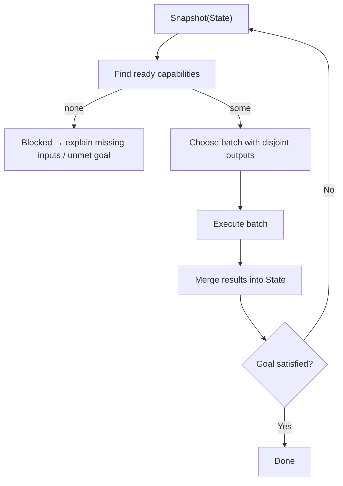

Here’s a fresh README you can drop straight into `README.md` and tweak as you like:

---

````markdown
# Ranger — Evidence-Driven Execution Engine for LLM Systems

> **Status:** Experimental / pre-1.0. APIs and folder layout may change.

Ranger is a **topology-style execution engine** for building long-running, stateful workflows around LLMs, tools, and humans.

Instead of hand-written orchestration loops, you write small Python functions that declare:

- which **State** keys they read, and  
- which **State** keys they write.

Ranger figures out **what to run, when, and in parallel**, stores the full run in a local database, and lets you replay and inspect everything after the fact. “Agents” are just one pattern built on top of this engine.

---

## Why Ranger?

Ranger is meant for people who care more about **reproducibility, provenance, and control** than about yet another chat loop.

- **Execution engine, not just an agent framework**  
  Use it for test writers, research pipelines, guardrails, ETL-ish flows, or anything that naturally looks like “compute new facts from existing facts”.

- **Evidence-driven**  
  All state for a run lives in one place (`.ranger/<domain>.db`), together with coverage, timing, and goal status. You can replay and inspect runs later.

- **Zero orchestration code**  
  You never write the “while not done: call tool A, then B” loop. The engine watches how State changes and activates only the capabilities that are now ready.

- **Safe parallelism by construction**  
  Ranger only batches capabilities that write to disjoint State keys. That gives you concurrency without data races.

- **Guardrail-friendly**  
  Because all reads/writes are explicit, it’s easy to hang guard regions, policy checks, or risk scoring around the engine without hiding logic in callbacks.

If you like **dataflow / category-theory flavored** ways of thinking (“everything is a morphism over shared context”), Ranger is built for that.

---

## Mental Model (90 seconds)

At the core there are just three ideas:

1. **State**  
   A typed key–value map, for example:

   ```python
   {
       "repo.ast": {...},
       "tests.gen": {...},
       "run.result": {...},
   }
````

2. **Capabilities (Steps / Tools / LLMs / Humans)**
   Each capability declares:

   * `inputs=[...]` – the keys it must see in State before running
   * `outputs=[...]` – the keys it promises to write back into State

   It returns a small dict of `{key: value}` updates; Ranger merges that into the snapshot atomically.

3. **Planner + Goal**

   * A capability becomes **ready** when:

     * all its `inputs` exist in State, and
     * at least one of its `outputs` is missing, **or** any input changed since it last ran.
   * The engine takes a snapshot, finds all ready units, picks a **compatible batch** (no two write the same key), runs them, commits, and repeats.
   * After each batch, a **Goal** predicate checks whether you’re done (or explains why you’re blocked).

In (very rough) pseudo-diagram:



No loops or if/else chains in user code. All control flow **emerges** from how State evolves.

---

## DX Vocabulary

You’ll mostly work with these decorators and types:

* **`@step`** – Pure transform over State (no side effects).
* **`@tool`** – Side-effecting action (HTTP calls, subprocesses, filesystem, etc.).
* **`@llm`** – Tool specialized for LLM calls (prompt + schema + retries + provider).
* **`@human`** – Human-in-the-loop action (for review / approvals; UI layer is WIP).
* **`@goal`** – Predicate over State that decides when a run is finished.
* **`Agent`** – Minimal runner that repeatedly applies ready capabilities until the goal passes or you hit a budget.

All of these work over the same `State` object; the difference is semantics (pure vs side-effecting vs LLM vs human).

---

## Hello, Ranger (no LLMs)

Here’s a tiny example with no APIs or models. It computes `c = (a + 1) * 2` and stops when `c == 4`.

```python
from core.sdk import step, goal, Agent

@step(inputs=["a"], outputs=["b"])
def inc(state):
    return {"b": state["a"] + 1}

@step(inputs=["b"], outputs=["c"])
def double(state):
    return {"c": state["b"] * 2}

@goal(scope={"c"})
def done(state):
    return state.get("c") == 4

if __name__ == "__main__":
    agent = Agent([inc, double])
    result = agent.run(initial={"a": 1}, goal=done, max_steps=10)

    assert result.ok, result
    print("Final c:", result.final.value("c"))
```

There is **no orchestration** in this script. The engine:

1. Sees `"a"` → runs `inc` → writes `"b"`.
2. Sees `"b"` → runs `double` → writes `"c"`.
3. Goal sees `"c == 4"` → run finishes.

---

## A Small ReAct-Style Agent

Because control flow is driven by State, ReAct patterns fall out naturally:

```python
from core.sdk import step, tool, llm, goal, Agent

# REASON: decide whether to search or answer
@llm(
    inputs=["question", "obs"],
    outputs=["thought"],
    system="Return JSON {thought:str} with either 'search' or 'answer'.",
    template='{"thought":"{{ "search" if (obs|length) < 2 else "answer" }}"}',
    schema={
        "type": "object",
        "properties": {"thought": {"type": "string"}},
        "required": ["thought"],
    },
    provider=my_llm_provider,
)
def think(state):
    ...

# PLAN: craft a query when needed
@step(inputs=["question", "thought"], outputs=["query"])
def plan(state):
    if state["thought"] == "search":
        return {"query": f"{state['question']} key facts"}
    return {"query": ""}

# ACT: perform the search (side effect → Tool)
@tool(inputs=["query", "obs"], outputs=["obs"])
def search(state):
    q = state["query"]
    obs = state.get("obs", [])
    if not q:
        return {"obs": obs}
    return {"obs": obs + [{"source": "stub", "snippet": f"Result:{q}"}]}

# WRITE: produce an answer draft
@llm(
    inputs=["question", "obs"],
    outputs=["answer.draft"],
    system="Return JSON {text:str, citations:list}.",
    template='{"text":"Answer to {{question}}.","citations":[]}',
    schema={
        "type": "object",
        "properties": {"text": {"type": "string"}, "citations": {"type": "array"}},
        "required": ["text", "citations"],
    },
    provider=my_llm_provider,
)
def write(state):
    ...

@goal(scope={"answer.draft"})
def answered(state):
    return "answer.draft" in state

if __name__ == "__main__":
    Agent([think, plan, search, write]).run(
        initial={"question": "What is ReAct?", "obs": []},
        goal=answered,
        max_steps=20,
    )
```

The engine automatically:

* loops between **Reason → Plan → Search** while `thought == "search"`,
* then shifts to **Reason → Write** once there are enough observations.

You never write that loop explicitly.

---

## Installation and Quickstart

For now, Ranger is meant to be used from a clone of this repository.

```bash
git clone https://github.com/skishore23/ranger.git
cd ranger
pip install -e .  # editable install for development
```

### Path A — Use as a Library

1. Add `ranger` to your project’s virtualenv (via the `pip install -e .` above).
2. Import from `core.sdk`, define a few capabilities, and call `Agent.run(...)` as in the examples.
3. Inspect `result.final` and, if needed, the underlying scenario database for that run.

### Path B — Use the CLI

The `ranger` CLI helps you scaffold and inspect agents that follow Ranger’s conventions:

```bash
# Scaffold a new agent package + smoke tests
ranger init demo-agent

# Inspect memory atoms in a run database
ranger trace demo.db --domain demo --limit 20

# Replay a run as a "scenario" and dump JSON coverage + goals
ranger scenario demo.db --domain demo --json

# Visualize capability graphs (requires Graphviz + optional extras)
ranger visualize agents.testwriter.agent:TestWriterAgent --repo . --format svg
ranger visualize agents.deep_research.agent:DeepResearchAgent --repo . --format svg
```

The scaffold mirrors the bundled agents and wires up memory + LLM regions via `boot.py`. Run `ranger --help` for a full list of commands.

---

## Agents, Plans, and Runtime

For larger projects you’ll usually:

* Build **plain capabilities** with `@step`, `@tool`, `@llm`, `@human`.
* Compose them into a **Plan** using `core.plan.plan` and `core.plan.action`.
* Wrap the compiled plan in an **`AgentRuntime`** subclass that:

  * configures memory domains and filenames,
  * registers LLM profiles,
  * applies guard regions,
  * exposes a simple `.run(...)` facade for callers.

Example sketch:

```python
from agents.common import AgentRuntime
from boot import get_default_budget, setup_openai_llm
from core.llm.provider import register_llm_profile
from core.plan import plan, action
from . import capabilities  # your @step/@tool/@llm functions

class MyAgent(AgentRuntime):
    def __init__(self, **runtime_options):
        super().__init__(
            budget=get_default_budget(),
            memory_key="myagent.memory",
            memory_domain="myagent",
            db_filename="myagent.db",
            **runtime_options,
        )

    def build_plan(self):
        register_llm_profile(
            "myagent.generate",
            region_key="myagent.llm",
            defaults={"model": "gpt-4o-mini", "temperature": 0.0},
            region_factory=lambda: setup_openai_llm(
                key="myagent.llm",
                model="gpt-4o-mini",
                temperature=0.0,
            ),
        )
        stages = [
            capabilities.step1,
            capabilities.step2,
            # ...
        ]
        return plan(*[action(cap) for cap in stages])

    def run(self, *, max_steps: int = 120):
        return self.run_agent(
            initial={"myagent.config": {...}},
            goal=capabilities.my_goal,
            max_steps=max_steps,
        )
```

`AgentRuntime` takes care of registry resets, scenario harness, and visualization so your façade stays small.

---

## Scenarios, Traces, and Visualization

Every run is backed by a **scenario database** under `.ranger/`. For a given domain:

* **State snapshots** (before/after each batch)
* **Capability executions** (inputs, outputs, timings)
* **Goal evaluations** and “why not yet done” explanations

all land in one file, e.g. `.ranger/testwriter.db`.

You can then:

* Inspect raw atoms:

  ```bash
  ranger trace testwriter.db --domain testwriter --limit 50
  ```

* Replay and summarize:

  ```bash
  ranger scenario testwriter.db --domain testwriter --json
  ```

* Render a capability graph:

  ```bash
  ranger visualize agents.testwriter.agent:TestWriterAgent --repo . --format svg
  ```

This makes Ranger feel closer to a **build system or debugger** than to a black-box chatbot.

---

## Repository Layout

This repo is organized into a few layers:

* `core/` – the engine: State, Snapshot, planner, runners, plan builder, LLM provider wiring.
* `ranger/` – CLI entry points and developer tooling.
* `agents/` – example agents (test-writer, deep research, etc.) built on top of the engine.
* `regions/`, `topology/`, `studio/` – experiments around guard regions, topology primitives, and UI (subject to change).
* `docs/` – reference documentation and longer guides.
* `tests/` – unit/integration tests for the engine and example agents.

You can depend only on `core/` + `ranger/` if you just want the engine; the contents of `agents/` are examples / recipes.

---

## When Should You Use Ranger?

Ranger is a good fit if:

* You are building **non-trivial LLM systems** (test writers, research agents, safety pipelines, etc.) that:

  * touch many sources of truth,
  * have multiple asynchronous or side-effecting steps,
  * need **replayable, explainable** behavior.
* You want to treat orchestration as a **data problem** (“what facts do we know now, what can we compute next?”) instead of manually coding loops.
* You care about **guardrails** and **risk controls** that can inspect and shape State over time.

It might be overkill if:

* You just need a single LLM call plus one or two tools.
* You don’t care about replay, provenance, or long-term maintainability of flows.

---

## Documentation & Next Steps

Extended docs live under `docs/`:

* `docs/API_REFERENCE.md` – concise API map for decorators, engine types, and CLI.
* `docs/AGENT_GUIDE.md` (planned) – deeper guide to building agents using `AgentRuntime` and plans.
* `docs/LLM_PROVIDER_GUIDE.md` (planned) – wiring different LLM providers and profiles.

Planned improvements:

* More example agents (e.g., guardrail-heavy flows).
* Better studio / UI for inspecting runs and human-in-the-loop steps.
* Richer guard region integration.
* Distributed execution and worker pools.

```

::contentReference[oaicite:0]{index=0}
```
