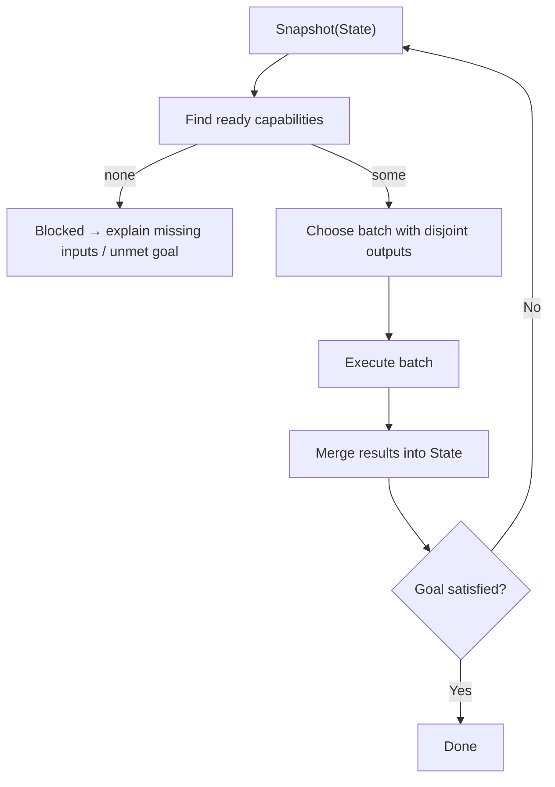

# Ranger — Evidence-First Execution Engine.

> **Status:** Experimental / pre-1.0. APIs and folder layout may change.

Ranger is an execution engine for long-lived, stateful workflows that use LLMs, tools, and human input. You write plain Python functions that declare what data they need and what data they produce. Ranger figures out the order to run them and records each step in a local database so you can inspect, replay, and compare runs later.

Instead of hand-rolled `while True` loops and ad-hoc logging, you get a simple dataflow:
state goes in → steps fire when their inputs are ready → new state comes out. Ranger keeps the full trace so you can see how a result was produced and how a change in model, prompt, or code affects behavior.

---

## What you get 

- **Replayable runs**  
  Every run is stored in `.ranger/<domain>.db` with state snapshots and step metadata. You can re-run a scenario, step through it, or diff runs across versions.

- **Automatic scheduling**  
  Steps declare the keys they read and write. Ranger only runs a step when its inputs are present and at least one output needs an update, and it batches non-conflicting steps for a bit of parallelism.

- **Less orchestration code**  
  Most control flow falls out of the data dependencies. You focus on small, testable functions; Ranger takes care of “what should run next?”

- **Guardrail-friendly**  
  Because reads and writes are explicit, it’s straightforward to layer policies, checks, or risk scoring around the engine without burying them in glue code.

If you like treating workflows as dataflow—“what do we know now, what can we safely compute next?”—Ranger is built with that style in mind.

---

## Mental Model (90 seconds)

At the core there are just three ideas:

1. **State**  
   A typed key–value map, for example:

   ```python
   {
       "repo.ast": {...},
       "tests.gen": {...},
       "run.result": {...},
   }
   ```

2. **Capabilities (Steps / Tools / LLMs / Humans)**  
   Each capability declares:

   - `inputs=[...]` – the keys it must see in State before running  
   - `outputs=[...]` – the keys it promises to write back into State

   It returns a small dict of `{key: value}` updates; Ranger merges that into the snapshot atomically.

3. **Planner + Goal**  

   - A capability becomes **ready** when:
     - all its `inputs` exist in State, and  
     - at least one of its `outputs` is missing, **or** any input changed since it last ran.
   - The engine takes a snapshot, finds all ready units, picks a **compatible batch** (no two write the same key), runs them, commits, and repeats.
   - After each batch, a **Goal** predicate checks whether you’re done (or explains why you’re blocked).

Execution topology at a glance:



- **Snapshot(State)** freezes the current evidence so readiness decisions are deterministic and replayable.
- **Find ready capabilities** surfaces every transformation whose declared inputs exist and at least one promised output still needs to be written.
- **Choose batch with disjoint outputs** enforces conflict-free parallelism; the topology rejects any combination that would contend for the same key.
- **Execute batch → Merge results** runs the selected morphisms, merges their updates atomically, and records provenance alongside timings.
- **Goal satisfied?** evaluates a declarative predicate that either certifies completion or explains which facts are still missing.

No loops or if/else chains live in user code. Control flow **emerges** from how State evolves.

---

## DX Vocabulary

Everything you ship inside Ranger is a typed morphism over `State`. Decorators describe the semantics of that morphism so the topology, planner, and runners can reason about it deterministically.

- **`@step`** – Pure function that reads immutable inputs, emits new facts, and can be retried freely. Validation in `core.validate` makes sure you only reference declared keys.  
- **`@tool`** – Side-effecting capability (HTTP calls, shell work, filesystem, etc.) executed through the Python runner. Declares exactly which State it mutates so provenance stays intact.  
- **`@llm`** – Structured LLM call configured through `core.llm.provider`. Prompts, schemas, and retry policies are part of the decorator, keeping generations reproducible.  
- **`@human`** – Human-in-the-loop checkpoint executed by `core.runners.human_runner`, often used for attestation or approvals.  
- **`@goal`** – Declarative predicate that certifies completion or explains why you are still blocked.  
- **`Agent`** – Thin runner (`core.engine.Agent`) that keeps applying ready capabilities inside your budget until the goal passes.

All decorators operate on the same immutable snapshot. Ranger enforces fail-fast semantics: missing inputs or conflicting outputs cause immediate validation errors instead of silent fallbacks.

### State contracts & provenance

- **Contracts** – `core.capability` and `core.plan` track every key that a capability reads or writes, enabling deterministic scheduling and guardrail enforcement.  
- **Provenance** – `core.provenance` records coverage, timings, and evidence for every capability so you can replay or audit any run later.  
- **Topology** – Modules under `topology/` (planner, packer, attest) construct the execution graph, ensure disjoint writes, and certify batches before they ever reach a runner.

---

## Hello, Ranger (no LLMs)

Here’s a tiny example with no APIs or models. It computes `c = (a + 1) * 2` and stops when `c == 4`.

```python
from core.sdk import step, goal, Agent

@step(inputs=["a"], outputs=["b"])
def inc(state):
    return {"b": state["a"] + 1}

@step(inputs=["b"], outputs=["c"])
def double(state):
    return {"c": state["b"] * 2}

@goal(scope={"c"})
def done(state):
    return state.get("c") == 4

if __name__ == "__main__":
    agent = Agent([inc, double])
    result = agent.run(initial={"a": 1}, goal=done, max_steps=10)

    assert result.ok, result
    print("Final c:", result.final.value("c"))
```

There is **no orchestration** in this script. The engine:

1. Sees `"a"` → runs `inc` → writes `"b"`.
2. Sees `"b"` → runs `double` → writes `"c"`.
3. Goal sees `"c == 4"` → run finishes.

That entire trace is stored in `.ranger/demo.db`: the snapshot deltas, timings, and goal evaluations. You can replay it with `ranger scenario`, diff it against future runs, or visualize it with `ranger visualize` to confirm the topology behaves as intended.

---

## A Small ReAct-Style Agent

Because control flow is driven by State, ReAct patterns fall out naturally:

```python
from core.sdk import step, tool, llm, goal, Agent

# REASON: decide whether to search or answer
@llm(
    inputs=["question", "obs"],
    outputs=["thought"],
    system="Return JSON {thought:str} with either 'search' or 'answer'.",
    template='{"thought":"{{ "search" if (obs|length) < 2 else "answer" }}"}',
    schema={
        "type": "object",
        "properties": {"thought": {"type": "string"}},
        "required": ["thought"],
    },
    provider=my_llm_provider,
)
def think(state):
    ...

# PLAN: craft a query when needed
@step(inputs=["question", "thought"], outputs=["query"])
def plan(state):
    if state["thought"] == "search":
        return {"query": f"{state['question']} key facts"}
    return {"query": ""}

# ACT: perform the search (side effect → Tool)
@tool(inputs=["query", "obs"], outputs=["obs"])
def search(state):
    q = state["query"]
    obs = state.get("obs", [])
    if not q:
        return {"obs": obs}
    return {"obs": obs + [{"source": "stub", "snippet": f"Result:{q}"}]}

# WRITE: produce an answer draft
@llm(
    inputs=["question", "obs"],
    outputs=["answer.draft"],
    system="Return JSON {text:str, citations:list}.",
    template='{"text":"Answer to {{question}}.","citations":[]}',
    schema={
        "type": "object",
        "properties": {"text": {"type": "string"}, "citations": {"type": "array"}},
        "required": ["text", "citations"],
    },
    provider=my_llm_provider,
)
def write(state):
    ...

@goal(scope={"answer.draft"})
def answered(state):
    return "answer.draft" in state

if __name__ == "__main__":
    Agent([think, plan, search, write]).run(
        initial={"question": "What is ReAct?", "obs": []},
        goal=answered,
        max_steps=20,
    )
```

The engine automatically:

- loops between **Reason → Plan → Search** while `thought == "search"`,  
- then shifts to **Reason → Write** once there are enough observations.

You never write that loop explicitly.

Behind the scenes, `topology.planner` keeps recomputing readiness as new evidence lands in `"obs"`, and the attestation layer (`topology.attest`) ensures that the `think`, `plan`, `search`, and `write` capabilities never race over the same keys. The scenario database retains every prompt, response, and decision, so you can audit why a particular answer was produced.

---

## Installation and Quickstart

For now, Ranger is meant to be used from a clone of this repository.

```bash
git clone https://github.com/skishore23/ranger.git
cd ranger
pip install -e .  # editable install for development
```

### Path A — Use as a Library

1. Add `ranger` to your project’s virtualenv (via the `pip install -e .` above).
2. Import from `core.sdk`, define a few capabilities, and call `Agent.run(...)` as in the examples.
3. Inspect `result.final` and, if needed, the underlying scenario database for that run.

### Path B — Use the CLI

The `ranger` CLI helps you scaffold and inspect agents that follow Ranger’s conventions:

```bash
# Scaffold a new agent package + smoke tests
ranger init demo-agent

# Inspect memory atoms in a run database
ranger trace demo.db --domain demo --limit 20

# Replay a run as a "scenario" and dump JSON coverage + goals
ranger scenario demo.db --domain demo --json

# Visualize capability graphs (requires Graphviz + optional extras)
ranger visualize agents.testwriter.agent:TestWriterAgent --repo . --format svg
ranger visualize agents.deep_research.agent:DeepResearchAgent --repo . --format svg
```

The scaffold mirrors the bundled agents and wires up memory + LLM regions via `boot.py`. Run `ranger --help` for a full list of commands.

---

## Agents, Plans, and Runtime

For larger projects you codify a plan once and let the runtime enforce it with evidence checks:

- Build **plain capabilities** with `@step`, `@tool`, `@llm`, `@human`.
- Compose them into a **Plan** using `core.plan.plan` and `core.plan.action`.
- Wrap the compiled plan in an **`AgentRuntime`** subclass that:
  - configures memory domains and filenames,
  - registers LLM profiles,
  - applies guard regions,
  - exposes a simple `.run(...)` facade for callers.

`agents/common/runtime.AgentRuntime` wires those pieces into budgets, attestation, and visualization hooks so you can focus on the morphology of your domain rather than wiring.

Example sketch:

```python
from agents.common import AgentRuntime
from boot import get_default_budget, setup_openai_llm
from core.llm.provider import register_llm_profile
from core.plan import plan, action
from . import capabilities  # your @step/@tool/@llm functions

class MyAgent(AgentRuntime):
    def __init__(self, **runtime_options):
        super().__init__(
            budget=get_default_budget(),
            memory_key="myagent.memory",
            memory_domain="myagent",
            db_filename="myagent.db",
            **runtime_options,
        )

    def build_plan(self):
        register_llm_profile(
            "myagent.generate",
            region_key="myagent.llm",
            defaults={"model": "gpt-4o-mini", "temperature": 0.0},
            region_factory=lambda: setup_openai_llm(
                key="myagent.llm",
                model="gpt-4o-mini",
                temperature=0.0,
            ),
        )
        stages = [
            capabilities.step1,
            capabilities.step2,
            # ...
        ]
        return plan(*[action(cap) for cap in stages])

    def run(self, *, max_steps: int = 120):
        return self.run_agent(
            initial={"myagent.config": {...}},
            goal=capabilities.my_goal,
            max_steps=max_steps,
        )
```

`AgentRuntime` takes care of registry resets, scenario harness, and visualization so your façade stays small.

Attach regions (see `regions/`) for external memory or LLM providers, and the topology registry (`topology/registry.py`) will make the new capabilities available to the planner automatically.

---

## Scenarios, Traces, and Visualization

Every run is backed by a **scenario database** under `.ranger/`. For a given domain:

- **State snapshots** (before/after each batch)
- **Capability executions** (inputs, outputs, timings)
- **Goal evaluations** and “why not yet done” explanations

all land in one file, e.g. `.ranger/testwriter.db`.

You can then:

- Inspect raw atoms:

  ```bash
  ranger trace testwriter.db --domain testwriter --limit 50
  ```

- Replay and summarize:

  ```bash
  ranger scenario testwriter.db --domain testwriter --json
  ```

- Render a capability graph:

  ```bash
  ranger visualize agents.testwriter.agent:TestWriterAgent --repo . --format svg
  ```

This makes Ranger feel closer to a **build system or debugger** than to a black-box chatbot.

`ranger/scenario.py` drives those commands by replaying entries from `.ranger/<domain>.db` and rehydrating the provenance captured by `core.provenance`. Because every snapshot and capability write is recorded, audits become a matter of querying evidence rather than reproducing a flaky chat transcript.

---

## Repository Layout

This repo is organized into a few layers:

- `core/` – the engine: State snapshots, planner, runners, merge logic, provenance tracking, validation, and visualization support.  
- `ranger/` – CLI entry points plus tooling for tracing, visualization, and scaffolding.  
- `agents/` – sample agents (test-writer, deep research) that show how to pair plans with runtime facades.  
- `regions/` – memory and provider bindings (SQLite memory, OpenAI LLM, etc.) that you can register inside runtimes.  
- `topology/` – attesters, packers, planners, and registries that build the execution graph from declared capabilities.  
- `studio/` – experimental UI + topology builder tooling.  
- `docs/` – API and agent guides.  
- `tests/` – unit and integration coverage for engine, runners, and bundled agents.

Depending only on `core/` + `ranger/` gives you the execution engine and CLI; `agents/` and `regions/` stay optional reference implementations.

---

## When Should You Use Ranger?

Ranger is a good fit if:

- You are building **non-trivial LLM systems** (test writers, research agents, safety pipelines, etc.) that:
  - touch many sources of truth,
  - have multiple asynchronous or side-effecting steps,
  - need **replayable, explainable** behavior.
- You want to treat orchestration as a **data problem** (“what facts do we know now, what can we compute next?”) instead of manually coding loops.
- You care about **guardrails** and **risk controls** that can inspect and shape State over time.

It might be overkill if:

- You just need a single LLM call plus one or two tools.
- You don’t care about replay, provenance, or long-term maintainability of flows.

---
