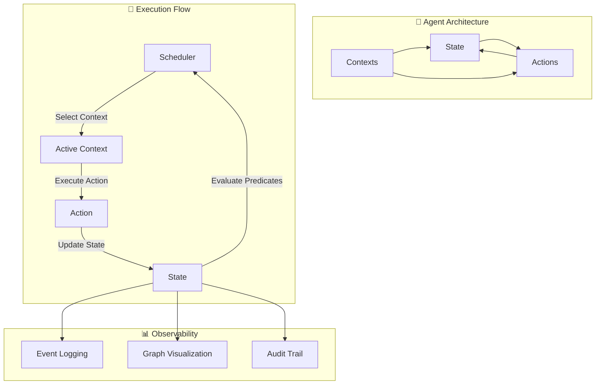
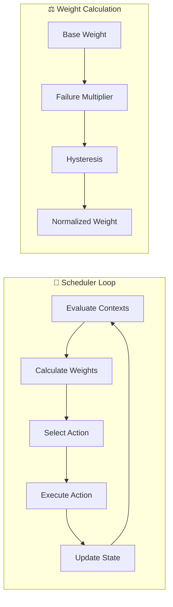
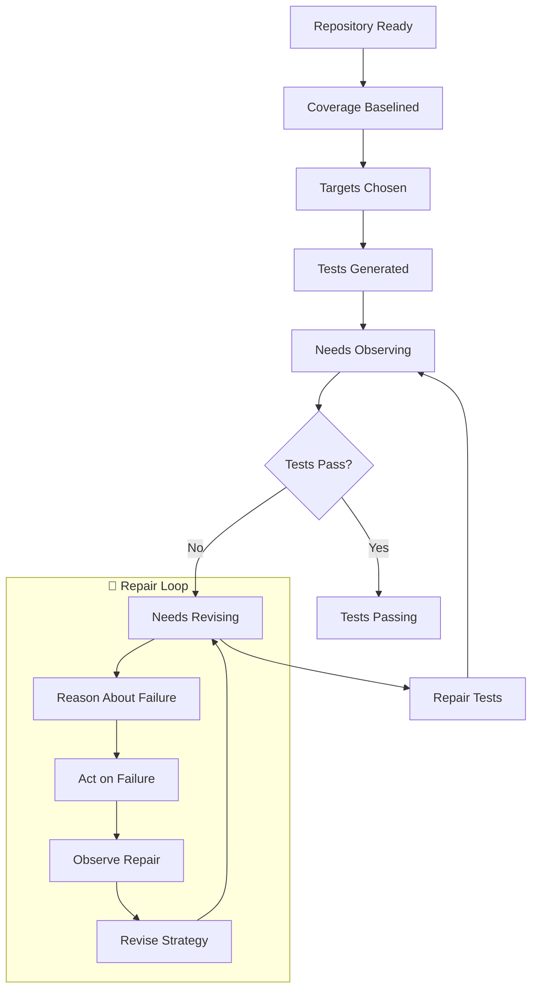

# 🎯 Ranger - Topological Agent Framework

> **Build agents as emergent topological systems where execution emerges from context transitions, not imperative control flow.**

A functional, category theory-inspired framework for building autonomous agents using topological regions and pure state transitions. Ranger is a novel approach to agent design based on directed graphs, context validity predicates, and emergent behavior.

## 🏗️ Architecture Overview



### Core Principles

- **🌐 Topological Execution**: Agents are directed graphs where nodes are contexts and edges are state transitions
- **🔄 Emergent Behavior**: Complex behaviors emerge from simple context validity predicates
- **⚡ Pure Functions**: All actions are pure functions with clear input/output contracts
- **🛡️ Fail-Fast**: No fallbacks or mocks - explicit error handling and circuit breakers
- **📊 Full Observability**: Comprehensive logging, visualization, and audit trails

## 🚀 Quick Start

### Installation

```bash
# Clone and setup
git clone <repository-url>
cd ranger
python -m venv .venv && source .venv/bin/activate
pip install -U pydantic httpx openai networkx matplotlib mypy python-dotenv typer
```

### Environment Setup

Create a `.env` file with your OpenAI API key:
```bash
OPENAI_API_KEY=sk-your-openai-api-key-here
```

### Run the Test-Writer Agent

```bash
# Generate tests for the current repository
python -m agents.testwriter.cli

# Generate tests for a specific repository
python -m agents.testwriter.cli --repo /path/to/your/project --max-ticks 50

# Generate tests with custom output directory
python -m agents.testwriter.cli --output-dir ./my_test_output
```

### Run the Demo Agent

```bash
python -m agents.demo.run_demo
```

## 📋 Table of Contents

- [🏗️ Architecture Overview](#️-architecture-overview)
- [🧠 Core Concepts](#-core-concepts)
- [🎯 Test-Writer Agent](#-test-writer-agent)
- [🛠️ How to Create an Agent](#️-how-to-create-an-agent)
- [📊 Observability](#-observability)
- [🔧 Development](#-development)
- [📚 API Reference](#-api-reference)

## 🧠 Core Concepts

### Contexts

Contexts define **regions of validity** in the agent's execution space. Each context has:

- **Predicate**: A pure function that determines if the context is active
- **Resources**: Shared resources that create overlaps with other contexts
- **Actions**: Available actions when the context is active

```python
def repo_ready(state: State) -> bool:
    """Context is active when repository is ready for analysis."""
    return (
        state.data.get("repo_path") is not None and
        state.data.get("venv_active", False)
    )

repo_context = Context(
    id="repo_ready",
    label="Repository Ready",
    is_valid=repo_ready,
    resources=["filesystem", "python_env"],
    actions=[RunPytestCov()]
)
```

### Actions

Actions are **pure functions** that transform state. They define:

- **Preconditions**: When the action can execute
- **Arguments**: What data they need from state
- **Execution**: The pure transformation logic
- **Postconditions**: What they guarantee to produce

```python
class RunPytestCov(Action):
    name: str = "run_pytest_cov"
    locks: List[str] = ["filesystem"]
    
    def pre(self, state: State) -> bool:
        """Can run when repository is ready."""
        return state.data.get("repo_path") is not None
    
    def args(self, state: State) -> Dict[str, JSONValue]:
        """Extract arguments from state."""
        return {"repo_path": state.data["repo_path"]}
    
    def run(self, state: State, **kwargs) -> Optional[Delta]:
        """Execute pytest with coverage."""
        repo_path = kwargs["repo_path"]
        result = subprocess.run(["pytest", "--cov=.", "--cov-report=xml"])
        
        return {
            "set": {
                "baseline_coverage": parse_coverage_xml(result),
                "pytest_output": result.stdout
            }
        }
```

### State Management

State is **immutable** and managed through deltas:

```python
# State structure
state = State(
    data={
        "repo_path": "/path/to/repo",
        "coverage_target": 80.0,
        "failing_tests": ["test_foo.py::test_bar"]
    },
    meta={"tick": 42, "active_contexts": ["needs_revising"]}
)

# State updates through deltas
delta = {
    "set": {"new_coverage": 85.0},
    "unset": ["failing_tests"],
    "increment": {"repair_attempts": 1}
}
```

### Scheduler

The scheduler implements a **partition-of-unity weight system** that:

- Evaluates all context predicates
- Calculates weights based on state and failure counts
- Selects actions using topological ordering
- Prevents infinite loops with circuit breakers



## 🎯 Test-Writer Agent

The Test-Writer Agent is a complete implementation that demonstrates Ranger by autonomously generating and repairing tests for Python codebases.

### Agent Flow



### Key Features

- **🎯 AST-Driven Generation**: Analyzes code structure to prioritize important functions
- **🔄 Self-Repairing**: Automatically fixes failing tests using LLM-powered repair
- **📊 Coverage-Driven**: Focuses on improving code coverage metrics
- **🛡️ Circuit Breakers**: Prevents infinite repair loops with attempt limits
- **📝 Comprehensive Logging**: Full audit trail of all decisions and repairs

### Usage Examples

```bash
# Basic usage - analyze current directory
python -m agents.testwriter.cli

# Analyze specific repository with custom settings
python -m agents.testwriter.cli \
    --repo /path/to/project \
    --max-ticks 100 \
    --output-dir ./test_results

# Focus on specific coverage targets
python -m agents.testwriter.cli \
    --repo /path/to/project \
    --coverage-target 85.0
```

### Output Structure

```
testwriter_output/
├── tests/generated/           # Generated test files
├── events.jsonl              # Execution log
├── audit.jsonl               # Detailed audit trail
├── state_graph.png           # Visual execution graph
└── REPORT.md                 # Summary report
```

## 🛠️ How to Create an Agent

Creating your own agent is straightforward with Ranger. See our comprehensive [Agent Creation Guide](./AGENT_GUIDE.md) for a step-by-step walkthrough.

**Quick Overview:**

1. **Define Contexts** - Regions where your agent operates
2. **Implement Actions** - Pure functions that transform state  
3. **Create Goal** - Define success criteria
4. **Build CLI** - Command-line interface
5. **Add Observability** - Logging and visualization
6. **Test Components** - Verify behavior

```python
# Example: Simple context definition
def files_ready(state: State) -> bool:
    return "file_list" in state.data and len(state.data["file_list"]) > 0

context = Context(
    id="files_ready",
    label="Files Ready",
    is_valid=files_ready,
    resources=["filesystem"],
    actions=[ProcessFilesAction()]
)
```

## 📊 Observability

Ranger provides comprehensive observability out of the box:

### Event Logging

All agent execution is logged to structured JSONL:

```json
{"tick": 1, "ctx": "repo_ready", "action": "run_pytest_cov", "status": "ok", "notes": "Coverage: 65.2%"}
{"tick": 2, "ctx": "targets_chosen", "action": "generate_tests", "status": "ok", "notes": "Generated 5 tests"}
```

### Visual Graphs

Automatic generation of execution graphs showing:

- **Context topology** - How contexts relate to each other
- **Execution path** - Which contexts were active when
- **State transitions** - How state evolved over time

### Audit Trails

Detailed audit logs capture:

- **LLM interactions** - Full prompts and responses
- **Decision points** - Why certain actions were chosen
- **Error handling** - How failures were managed
- **Performance metrics** - Timing and resource usage

### Real-time Monitoring

```python
# Enable real-time monitoring
from core.observe.log import init_logging

init_logging("./logs/events.jsonl")

# Custom metrics
from core.observe.log import emit, Event

emit(Event(
    tick=current_tick,
    ctx="custom_context",
    action="custom_action", 
    status="ok",
    notes="Custom metric: 42"
))
```

## 🔧 Development

### Type Checking

Ranger uses strict typing with mypy:

```bash
# Run type checking
mypy . --strict

# Check specific module
mypy agents/testwriter/ --strict
```

### Testing

```bash
# Run all tests
pytest

# Run with coverage
pytest --cov=core --cov=agents --cov-report=html

# Run specific test
pytest tests/test_scheduler.py -v
```

### Code Quality

```bash
# Format code
black .

# Sort imports
isort .

# Lint code
flake8 .
```

### Project Structure

```
ranger/
├── core/                      # Core framework
│   ├── action/               # Action system
│   ├── context/              # Context system  
│   ├── engine/               # Scheduler & execution
│   ├── llm/                  # LLM adapters
│   ├── observe/              # Logging & visualization
│   └── state/                # State management
├── agents/                   # Agent implementations
│   ├── demo/                 # Demo agent
│   └── testwriter/           # Test-writer agent
├── tests/                    # Unit tests
├── logs/                     # Runtime logs
└── pyproject.toml           # Project configuration
```

## 📚 API Reference

### Core Classes

#### Context

```python
@dataclass
class Context:
    id: str                           # Unique identifier
    label: str                        # Human-readable name
    is_valid: Callable[[State], bool] # Validity predicate
    resources: List[str]              # Shared resources
    actions: List[Action]             # Available actions
```

#### Action

```python
class Action:
    name: str                         # Action identifier
    locks: List[str]                  # Required resources
    timeout_s: int                    # Execution timeout
    
    def pre(self, state: State) -> bool:
        """Check if action can execute."""
        
    def args(self, state: State) -> Dict[str, JSONValue]:
        """Extract arguments from state."""
        
    def run(self, state: State, **kwargs) -> Optional[Delta]:
        """Execute the action."""
```

#### State

```python
@dataclass
class State:
    data: Dict[str, JSONValue]        # Application data
    meta: Dict[str, JSONValue]        # Framework metadata
```

#### Delta

```python
Delta = Dict[str, Dict[str, JSONValue]]

# Delta operations:
{
    "set": {"key": "value"},          # Set values
    "unset": ["key1", "key2"],        # Remove keys
    "increment": {"counter": 1},       # Increment numbers
    "append": {"list": ["item"]},      # Append to lists
    "extend": {"list": ["a", "b"]}     # Extend lists
}
```

### Scheduler Functions

```python
def run_agent(
    contexts: List[Context],
    goal: Goal,
    initial_state: Dict[str, JSONValue],
    max_ticks: int = 500
) -> AgentResult:
    """Run an agent to completion."""

def calculate_weights(state: State, contexts: List[Context]) -> Dict[str, float]:
    """Calculate context weights for selection."""
```

### Utility Functions

```python
# State management
def apply_delta(state: State, delta: Delta) -> bool:
    """Apply delta to state, return if changed."""

def snapshot_state(state: State) -> Dict[str, JSONValue]:
    """Create immutable snapshot of state."""

# Logging
def emit(event: Event) -> None:
    """Emit structured log event."""

def init_logging(log_file: Path) -> None:
    """Initialize logging system."""

# Visualization
def render_regions_and_path(
    contexts: List[Context],
    events: List[Event],
    output_path: Path
) -> None:
    """Generate execution graph visualization."""
```

---

## 🎉 Getting Started

1. **Clone the repository**
2. **Set up your environment** (Python 3.9+, OpenAI API key)
3. **Run the test-writer agent** on your codebase
4. **Explore the generated outputs** and visualizations
5. **Create your own agent** following the [guide](./AGENT_GUIDE.md)

Ranger enables you to build sophisticated, autonomous agents that are **observable**, **reliable**, and **maintainable**. Start with the test-writer agent to see the framework in action, then build your own domain-specific agents!

## 🤝 Contributing

We welcome contributions! Please see our contributing guidelines and feel free to open issues or submit pull requests.

## 📄 License

This project is licensed under the MIT License - see the LICENSE file for details.
