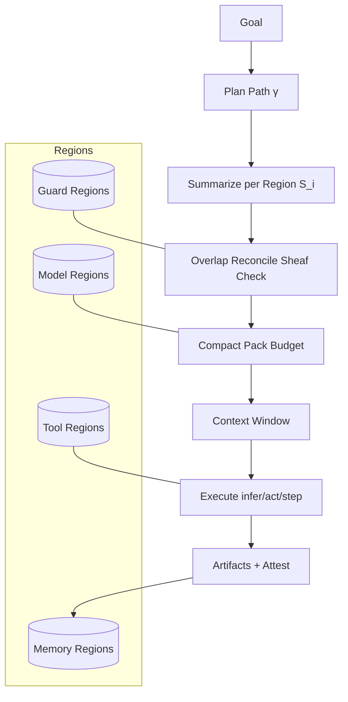
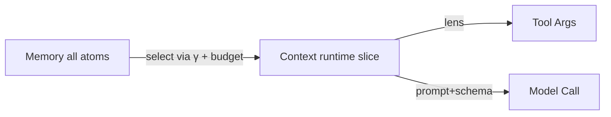

# Ranger Topology Add‑On: Memory · Context · Guardrails

> **TL;DR**
> Keep your existing **Step/Tool/Goal** DX. Add a thin **Topology Engine** where **everything is a Region** (Memory, Guard, LLM, Tool). A **Path (γ)** crosses regions, **stitches overlaps** (sheaf check), and **packs a context window** (the runtime slice of memory) under budgets. You get **reliability by construction** and a clean developer experience.

---

## 1) Purpose & Scope

We extend Ranger so an agent can:

* Treat **memory**, **guardrails**, **LLMs**, and **tools** uniformly as **regions**.
* Build **runtime context** as a **compact cover** of relevant regions under **token/time/action budgets**.
* Enforce **policy** and **consistency** via sheaf‑style overlap checks.
* Emit **attested traces** for reliability (audit, replay, rollback).

This document describes the mental model, minimal APIs, and how to layer the Topology Engine without changing your Step/Tool code.

---

## 2) Mental Model (90 seconds)

* **State**: your working key‑value map (same as today).
* **Memory**: the warehouse of facts/artifacts (DB, vector store, logs, files).
* **Context**: the **runtime slice** of Memory the engine packs into the model/tool window for the current step.
  *Context ⊂ Memory; it’s selected by a path γ and budgeted packing.*
* **Region (Uᵢ)**: a neighborhood of related atoms (facts/artifacts). Everything is a region:

  * **MemoryRegion** (store/recall)
  * **GuardRegion** (validate/constrain/repair)
  * **ModelRegion** (LLM; reason/generate)
  * **ToolRegion** (act; side‑effects; idempotent)
* **Overlap (Uᵢ∩Uⱼ)**: where two regions share scope; we reconcile summaries here.
* **Path (γ)**: a trajectory through regions that normalizes memory + tools + guards into an executable context.
* **Compact Cover**: minimal set of regions that support the step/goal within budget.

Reliability mapping lives on this surface (correctness, safety, repeatability, robustness, recoverability, observability, efficiency).

---

## 3) Minimal Engine Pieces

### 3.1 Atom (unit of memory)

```python
from dataclasses import dataclass
from typing import Any, Dict, Literal, Optional

Modality = Literal["text","code","image","table","json","log"]

@dataclass(frozen=True)
class Atom:
    id: str                 # content hash
    modality: Modality
    data: Any               # string/bytes/AST/etc.
    facets: Dict[str, Any]  # tags: run_id, file, tool, user, ts, domain, trust
    attest: Dict[str, Any]  # {sig, parent, ts}
```

### 3.2 Region protocol

```python
from typing import Protocol, Iterable, Tuple

class Region(Protocol):
    key: str                # e.g. "mem.pg.finance", "guard.pii", "llm.oai.gpt", "tool.aws.ec2"
    kind: str               # "memory"|"guard"|"model"|"tool"

    def read(self, query: Dict) -> Iterable[Atom]: ...           # memory only
    def write(self, atoms: Iterable[Atom]) -> None: ...          # memory/tools

    def summarize(self, atoms: Iterable[Atom], goal: Dict) -> Atom: ...
    def reconcile(self, left: Atom, right: Atom, goal: Dict) -> Tuple[bool, Atom|None, str|None]: ...

    def infer(self, prompt: Dict, window: Iterable[Atom], budget: Dict) -> Iterable[Atom]: ...  # model
    def act(self, window: Iterable[Atom]) -> Tuple[Iterable[Atom], Iterable[Dict]]: ...        # tool (atoms, effects)

    def validate(self, atoms: Iterable[Atom]) -> Dict: ...        # guard {ok, findings}
```

> Implement only the methods that apply to your kind. Others can be no‑ops.

### 3.3 Registry, Planner, Stitcher, Packer

* **Registry**: `register_region(region)` puts it on the topology.
* **Planner (γ)**: chooses a minimal‑cost path that can (a) provide required inputs, (b) run guards, (c) call a model/tool, (d) write artifacts.
* **Stitcher**: `summarize` per region → reconcile overlaps (sheaf check) → produce a global summary `S`.
* **Packer**: score atoms then knapsack by budget → **Context Window**.

**Utility score** (default):

```
utility = α·recency + β·path_affinity + γ·overlap_centrality + δ·attestation_trust − ε·dup_penalty
```

---

## 4) Developer Experience (DX)

You keep **@step / @tool / @llm / @human / @goal** exactly as in your current guide.
Add these thin surfaces:

```python
from core.topology import register_region, budget
from core.regions import memory, guard, model, tool_region

# Register some regions at startup
register_region(memory.sqlite(key="mem.sqlite", path="./ranger.db", domain="finance"))
register_region(guard.pii(key="guard.pii"))
register_region(model.llm_openai(key="llm.oai.gpt", provider=OpenAIProvider(...)))
register_region(tool_region.aws_ec2(key="tool.aws.ec2"))

# Per-run budgets (tokens/time/calls and per-modality caps)
ctx_budget = budget(tokens=12000, ms=60000, calls=12, by_modality={"text":9000, "table":2000})
```

You **don’t** orchestrate regions. The Agent asks the Topology Engine for a window when a unit runs:

```python
window = topology.build_context(goal=..., state=..., budget=ctx_budget)
```

The engine will read from MemoryRegions, run GuardRegions, reconcile overlaps, and hand the **window** to your `@llm` provider and `@tool` lenses.

---

## 5) Guardrails as Regions

* **Validate**: run checks on atoms (toxicity, PII, schema, domain policy).
* **Summarize**: optionally redact or annotate.
* **Reconcile**: prefer stricter redaction or higher‑trust source on conflicts.
* **Block/Repair**: if `validate` fails, engine emits a **contradiction atom** and prevents risky ToolActions until resolved by a repair step.

**Example: PII Guard**

```python
register_region(guard.pii(key="guard.pii", mode="mask", types=["EMAIL","PHONE","SSN"]))
```

Guards run wherever the path crosses them; you can scope guards to region keys or goal scopes.

---

## 6) Memory as Regions

* Plug in SQLite/Postgres/Vec/S3; define `read/write/summarize/reconcile`.
* Use facets for **lineage** (run_id, tool, user, ts) and **trust** (source, signature).
* Common reconcile rules: newest‑wins, highest‑trust‑wins, or associative merges.

**Example: Postgres+Vector**

```python
register_region(memory.pg_vector(key="mem.pg.finance", dsn=..., table="atoms", domain="finance"))
```

---

## 7) Models & Tools as Regions

* **ModelRegion** backs `@llm` with budgets (tokens/time/calls) and returns atoms with usage facets.
* **ToolRegion** performs idempotent actions and emits compensations.

**Lens projection**: before calling a Tool, the engine projects the window to only the fields the tool needs (least privilege).

```python
from core.lens import args_only

projected = args_only(window, keys=["instance_id","desired_state"])  # fed to tool.aws_ec2
```

---

## 8) Execution Loop (no orchestration code)

```
repeat until Goal or budget:
  1) Snapshot(State)
  2) Find Ready Units (inputs exist AND outputs missing/changed)
  3) Query Topology Engine → Context Window for this unit
  4) If LLM → ModelRegion.infer(prompt, window, budget)
     If Tool → ToolRegion.act(projected_window)
     If Step → pure compute
  5) Guards validate summary/outputs; reconcile overlaps
  6) Verify & Commit (CAS); write artifacts to MemoryRegions with attestations
```

> **Context is just a slice of Memory.** The engine selects it **per unit** and per **budget**.

---

## 9) YAML Config (opt‑in)

```yaml
budget: { tokens: 12000, ms: 60000, calls: 12, byModality: { text: 9000, table: 2000 } }

regions:
  - mem.pg.finance
  - mem.sqlite
  - guard.pii
  - guard.financial
  - llm.oai.gpt
  - tool.aws.ec2
  - tool.slack.notify

path:
  requires:
    - read(mem.*)
    - validate(guard.*)
    - infer(llm.*)
    - act(tool.*)
  prefer:
    - minimize(cost)
    - maximize(attestationTrust)
```

---

## 10) Example: Upgrading the Test‑Writer Agent

Add persistent memory of ASTs & prior runs, plus guards.

```python
# Register regions at startup
register_region(memory.sqlite(key="mem.sqlite", path="./ranger.db", domain="code"))
register_region(guard.schema(key="guard.schema.tests", schema="pytest_testfile_v1"))
register_region(model.llm_openai(key="llm.oai.gpt", provider=OpenAIProvider(...)))

# Inside your @step/@tool functions you keep the same API. The engine:
# - pulls recent AST atoms for the package under test
# - ensures generated tests pass the schema guard
# - budgets tokens/time for @llm generate/repair
# - writes run results and test artifacts back to Memory with attestations
```

**What you gain**

* Stable retrieval (region‑bounded).
* Safer generations (guards on the path).
* Auditable lineage (attested atoms).
* Budget control (no runaway tokens).

---

## 11) Reliability Matrix (how it’s enforced)

| Dimension               | Mechanism                                                                           |
| ----------------------- | ----------------------------------------------------------------------------------- |
| **Correctness**         | Goal predicates & post‑conditions; overlap reconcile guards contradictions          |
| **Safety/Compliance**   | GuardRegions on path; lens projection; least privilege tools                        |
| **Repeatability**       | Seeded planner; deterministic stitch/pack; fixed provider seeds                     |
| **Robustness**          | Region‑local retries; backoff; overlap reconciliation; adversarial prompt hardening |
| **Recoverability**      | Tool idempotency keys; compensation effects; snapshot atoms for rollback            |
| **Observability/Audit** | Every atom/effect attested (sig,parent,ts); end‑to‑end path graph                   |
| **Efficiency**          | Context packing with budgets; call caps per region; cost‑aware path                 |

---

## 12) Diagrams (Mermaid)

**System (one surface)**



**Context is a slice of Memory**



---

## 13) Conformance Checklist (per Region)

* [ ] `summarize` is deterministic.
* [ ] `reconcile` associative/commutative or explicit precedence with evidence.
* [ ] `validate` returns stable schema & severities.
* [ ] `act` uses idempotency keys; yields compensations.
* [ ] `infer` enforces budget; returns usage facets.
* [ ] All outputs **attested** (`sig,parent,ts`).

---

## 14) Migration (1–2 hours)

1. **Register** your existing stores/tools as regions (3–5 functions each).
2. **Enable** baseline guards (PII/schema).
3. **Set** a budget and let the engine build windows.
4. **Add** reconcile rules for your common overlaps.
5. **Turn on** signed traces in non‑prod; review path graphs.

---

## 15) FAQ

**Q: Do I have to redesign my Steps/Tools?**
A: No. Your Step/Tool/Goal code stays the same. Regions are an engine‑level concern.

**Q: What if I don’t declare any regions?**
A: The engine degrades to current behavior: local state only, no external memory/guards.

**Q: Is context a separate store?**
A: No. Context is **computed** each run as a **slice of Memory** via path+budget.

**Q: Can guards block tools?**
A: Yes. Failed validations emit contradiction atoms and gate risky actions until repaired.

**Q: Can I use multiple LLM providers?**
A: Yes. Register multiple ModelRegions; the planner can pick by cost/quality policy.

---

**Done.** Drop this Topology Engine beside Ranger and keep your ergonomic DX; you’ll gain reliable memory/context/guardrails with provable behavior and clean audits.
