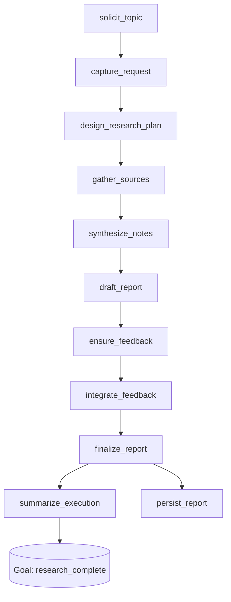

# Deep Research Agent Architecture

## Overview

The Deep Research agent is a topology-driven workflow that produces long-form, citation-rich reports. It orchestrates LLM-powered planning, Firecrawl web retrieval, structured synthesis, and human-in-the-loop review using Ranger capabilities.

Core goals:
- Produce 15+ page reports with rigorous citation counts.
- Capture provenance by persisting every stage as atoms in the `.ranger/deepresearch.db` SQLite store.
- Support optional human checkpoints for topic definition and editorial review.

## Capability Pipeline



### 1. Topic Intake (`solicit_topic`)
- Human capability prompts the operator to provide the research topic when it does not already exist in state.
- Uses `HumanRunner` to gather interactive CLI input.

### 2. Request Capture (`capture_request`)
- Normalises configuration, audience, and directives into a durable request atom (`deepresearch.request@v1`).

### 3. Planning (`design_research_plan`)
- Calls the OpenAI-backed region (with schema validation) to produce an outline, research questions, and query list.
- Persists the plan for later replay (`deepresearch.plan@v1`).

### 4. Retrieval (`gather_sources`)
- Issues Firecrawl API calls for each query; raising `GoalBlocked('source_fetch_failed')` on failure.
- Stores raw results as `deepresearch.source@v1` atoms.

### 5. Synthesis (`synthesize_notes`)
- Summarises sources into structured notes (findings, statistics, controversies).
- Falls back to deterministic template only when the model is unavailable.

### 6. Drafting (`draft_report`)
- Generates a multi-section report with citations and enforces length/citation minimums.
- Additional guardrails pad citations or extend content to satisfy configuration targets.

### 7. Human Feedback (`ensure_feedback` / `human_review`)
- `ensure_feedback` guarantees a `human.feedback` artifact (auto-approval unless `require_human_feedback=True`).
- When enabled, `human_review` posts a manual checkpoint.

### 8. Finalisation (`integrate_feedback`, `finalize_report`, `persist_report`)
- Integrates feedback, stamps metadata, and optionally writes a Markdown document to disk (including citation list).

### 9. Summary (`summarize_execution`)
- Emits metrics (character count, approximate pages, citation tally) to drive goal checks and analytics.

## Memory & Provenance

All atoms are written to `repo_root/.ranger/deepresearch.db`, isolating agent-specific data. The `ScenarioHarness` can replay atom histories to evaluate coverage and generate timelines.

Key schemas:
- `deepresearch.request@v1` – topic, config, directives.
- `deepresearch.plan@v1` – research plan sections and queries.
- `deepresearch.source@v1` – raw Firecrawl results with metadata.
- `deepresearch.notes@v1` – structured synthesis.
- `deepresearch.report@v1` / `deepresearch.citations@v1` – final deliverables.

## Human Interaction

The enhanced `HumanRunner` now supports CLI prompts, environment-variable overrides, and callback integration. Human capabilities can transform collected responses into workspace writes, enabling topic capture or feedback loops.

## Visualization

Use the shared helper to generate capability graphs:

```bash
pip install ranger[viz] graphviz
ranger visualize agents.deep_research.agent:DeepResearchAgent --repo . --format svg
```

## Files

- `capabilities.py` – declarative pipeline.
- `agent.py` – region setup and orchestration utilities.
- `firecrawl.py` – Firecrawl client (no synthetic fallbacks).
- `memory_bridge.py` – atom persistence helpers.
- `ARCHITECTURE.md` – this document.

